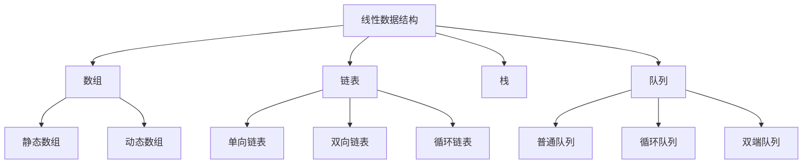

# 线性数据结构总览
总的来说就是：

```mermaid
flowchart TD
    Root["线性数据结构"]
    
    Arr["数组"]
    Link["链表"]
    Stack["栈"]
    Queue["队列"]

    Root --> Arr
    Root --> Link
    Root --> Stack
    Root --> Queue

    Arr --> StaticArr["静态数组"]
    Arr --> DynamicArr["动态数组"]

    Link --> SinglyLink["单向链表"]
    Link --> DoublyLink["双向链表"]
    Link --> CircularLink["循环链表"]

    Queue --> NormalQueue["普通队列"]
    Queue --> CircularQueue["循环队列"]
    Queue --> Deque["双端队列"]
```
线性数据结构包括了数组（静态和动态），包括了链表（单向，双向，循环），包括了队列，包括了栈。

# 评估优劣
为啥有这么多的先行数据结构，他们怎么用的？有什么优势和劣势？
## 针对线性数据结构的操作
1. 访问元素
2. 插入元素
3. 删除元素
4. 分配空间